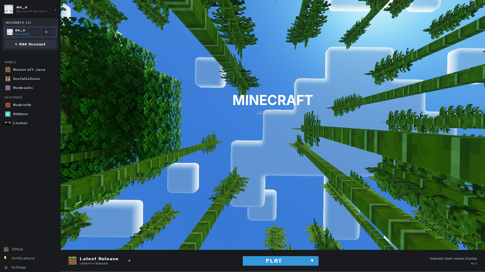
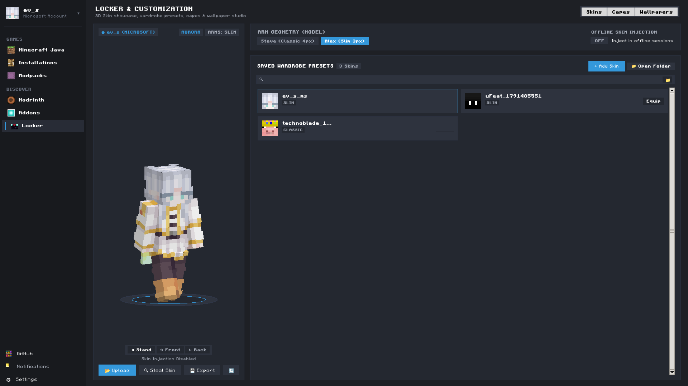
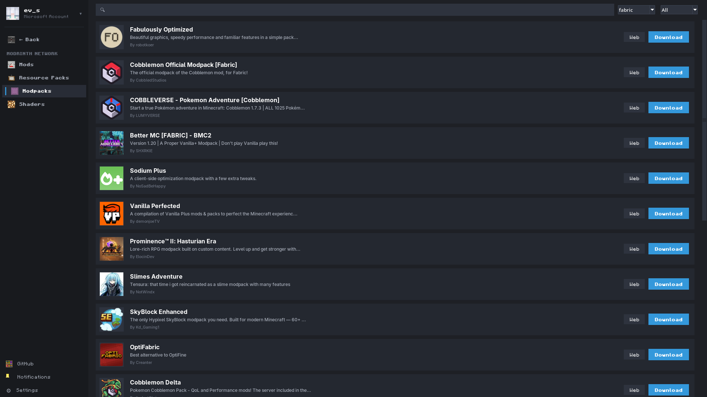
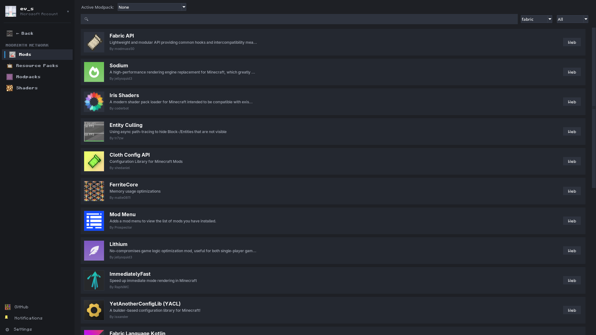

# New Launcher

**A fast, focused Minecraft Java launcher for Windows and Linux.**

New Launcher keeps the familiar parts of Minecraft launcher setup while making it easier to manage installations, modpacks, mods, skins, and profiles in one place.

<p align="center">
    <a href="https://github.com/Amne-Dev/New-launcher/releases/latest"></a>
    <a href="https://github.com/Amne-Dev/New-launcher/releases"></a>
    <a href="LICENSE"></a>
    <a href="https://github.com/Amne-Dev/New-launcher/issues"></a>
</p>

<p align="center">
    <a href="https://github.com/Amne-Dev/New-launcher/releases/latest">Download New Launcher</a>
    &nbsp;&middot;&nbsp;
    <a href="WIKI.md">Read the user guide</a>
    &nbsp;&middot;&nbsp;
    <a href="https://github.com/Amne-Dev/New-launcher/issues">Get help</a>
</p>

## See It In Action

<p align="center">
    
</p>

<p align="center">
    
    
</p>

<p align="center">
    
</p>

## Why New Launcher?

- **Start playing quickly.** Install and launch Minecraft Java Edition from a simple, familiar interface.
- **Keep installations organized.** Create separate profiles for different Minecraft versions and loaders.
- **Choose your mod setup.** Use Vanilla, Fabric, Forge, BatMod, LabyMod, or Lunar Client installations where supported.
- **Find and manage content.** Browse Modrinth, install modpacks, inspect mods, and turn individual mods on or off.
- **Make it yours.** Customize installation icons with Minecraft block textures and manage skins in the built-in locker.
- **Use the account setup that fits.** Sign in with Microsoft, connect supported skin services, or create an offline profile for local use.
- **Stay connected.** Optional Discord Rich Presence can show what you are playing.

## Install

### Windows

1. Open the [latest release](https://github.com/Amne-Dev/New-launcher/releases/latest).
2. Download `NLCSetup.exe`.
3. Run the installer and open **New Launcher** from the Start Menu.

### Linux

1. Open the [latest release](https://github.com/Amne-Dev/New-launcher/releases/latest).
2. Download the Linux AppImage.
3. Make it executable and launch it:

```bash
chmod +x NewLauncher-*.AppImage
./NewLauncher-*.AppImage
```

The AppImage is portable and does not require a system-wide installation.

## Your First Installation

1. Open **Profiles** and sign in with Microsoft, or create an offline profile for local use.
2. Open **Installations** and select **New Installation**.
3. Choose a Minecraft version and loader, then select an icon if you want to personalize it.
4. Return to **Play**, select the installation, and click **Play**.

New Launcher can download the files it needs when you create an installation. A Java runtime may also be downloaded automatically when a loader requires it.

## Modpacks, Mods, and Skins

The **Modrinth** area lets you discover modpacks and mods without leaving the launcher. Installed modpacks stay linked to their Minecraft installation, and individual mods can be enabled or disabled from the management view.

The **Locker** keeps your saved skins in one place. You can also use local skin files and supported online skin services.

## Settings

Open **Settings** to adjust Java memory, launcher behavior, and optional integrations. For a large modpack, increase the Java memory allocation gradually and leave enough memory available for your operating system.

## Documentation and Support

- [User guide and troubleshooting](WIKI.md)
- [Changelog](CHANGELOG.md)
- [Frequently asked questions](web/faq.html)
- [Report a bug or request a feature](https://github.com/Amne-Dev/New-launcher/issues)
- [Security policy](web/security.html)

## Build From Source

The launcher is written in Python. To run it locally, install the dependencies and start the application:

```bash
python -m pip install -r requirements.txt
python main.py
```

To build the Linux AppImage from the repository root:

```bash
chmod +x linux/build_appimage.sh
./linux/build_appimage.sh
```

See [CREDITS.md](CREDITS.md) for the libraries used by the project and [WIKI.md](WIKI.md) for contributor notes.

## License

New Launcher is open source. See [LICENSE](LICENSE) for the full license text.

New Launcher is not affiliated with Mojang Studios or Microsoft. Minecraft is a trademark of Microsoft Corporation.
